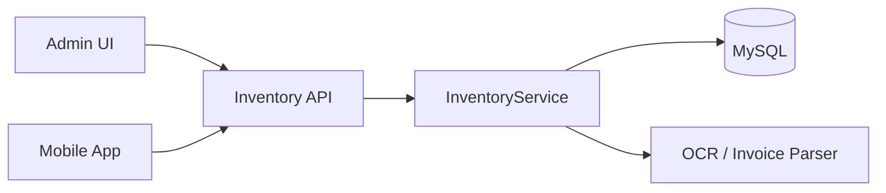

# Inventory Control Module — Architecture

## Overview

The Inventory Control plugin for Sparrow ERP provides stock tracking, multi-location and batch/lot support, costing (FIFO/LIFO/AVG), repack/split flows, FEFO picking suggestions, weight on transactions and batches, **supplier-facing** token-based API (confirm receipts, view PO status, upload compliance docs, view supplied batches/lots), CSV export, invoice OCR (Tesseract), and mobile-ready REST APIs with real-time Socket.IO events. **Customer-facing** features (order tracking, customer invoices, etc.) are **not** in this module; they will be implemented in a future Sales module. The system is modular so that Sales or Procurement modules can integrate with Inventory via internal APIs.

## High-Level Data Flow

## Invoice to Stock Flow

## Components

- **routes.py** — Flask blueprint; admin pages (including Repack/Split), JSON CRUD APIs, mobile scan/bulk APIs (with weight), repack and FEFO picking APIs, token create/list/revoke (supplier only), supplier-scoped endpoints (items, invoices, confirm receipt, batches, PO status, compliance list/upload), CSV export, invoice upload/apply, OpenAPI spec endpoint. `before_request` resolves Bearer tokens into `g.inventory_api_user`.
- **objects.py** — `InventoryService`: items, locations, batches, transactions (with weight), stock levels, costing (AVG/FIFO/LIFO), repack (one source batch → multiple new batches), `get_picking_suggestions_fefo`, invoices, `list_invoices`/`list_stock_levels_all`, dashboard metrics.
- **ocr.py** — `OCRProvider`, `TesseractOCRProvider`, `InvoiceParser`, `AmazonInvoiceParser`, `InventoryInvoiceService`.
- **install.py** — Creates tables: `inventory_items`, `inventory_locations`, `inventory_batches`, `inventory_stock_levels`, `inventory_transactions`, `inventory_suppliers`, `inventory_invoices`, `inventory_invoice_lines`, `inventory_supplier_performance`, `inventory_audit`, **inventory_purchase_orders**, **inventory_supplier_documents**, **inventory_api_tokens**. Migrations add weight/weight_uom and repack transaction type.
- **app/openapi_utils.py** — Shared OpenAPI 3 registry; plugins register paths and expose `/plugin/inventory_control/openapi.json`.

## Security & Audit

- **Access control**: Admin role only (aligned with the rest of the system; a future core update will refine permissions). Enforced via `@admin_required` and `_is_admin()` (admin/superuser).
- **Token auth (supplier portal only)**: External supplier access via **Bearer token**. Tokens stored as SHA-256 hash in `inventory_api_tokens`; role `supplier` with `supplier_id`. Permissions: confirm receipts, view POs, upload compliance docs, view their supplied batches/lots and invoices. Customer-facing features are in the Sales module; Inventory exposes internal APIs for customer data as needed. Session users with inventory permission can call supplier endpoints with optional query `supplier_id`.
- **Audit**: `log_audit()` writes to `current_app.audit_logger` and optional `inventory_audit` table for stock changes, edits, rollbacks, token create/revoke.
- **Real-time**: Socket.IO event `inventory_event` with types `stock_changed`, `invoice_parsed` for dashboard/mobile sync.

## Admin UI Walkthrough

1. **Dashboard** (`/plugin/inventory_control/`) — Health, total value, low stock count, expiring batches, recent transactions.
2. **Items** — Search by name/SKU/barcode; table of items (SPA-loaded via `/api/items`).
3. **Locations** — List warehouses/bins via `/api/locations`.
4. **Batches** — List batches/lots; filters by item; expiry highlighted.
5. **Repack / Split** (`/plugin/inventory_control/repack`) — Choose source batch and location; add output rows (quantity, weight, batch/lot numbers); submit to POST `/api/repack`.
6. **Transactions** — History with filters; rollback action.
7. **Invoices** — Upload image (PNG/JPG); OCR + parse; match lines to items; apply to stock at a location.
8. **Analytics** — Placeholder for stock levels, movers, supplier performance (APIs stubbed).

Export: CSV download via `/api/export/items`, `/api/export/transactions`, `/api/export/stock_levels`, `/api/export/batches` with `?format=csv`.

All pages extend **`admin/inventory_admin_base.html`**, which uses **MDB UI Kit** (`mdb.min.css` / `mdb.min.js`), the Sparrow ERP shared admin top nav, and a second-row Inventory subnav (same pattern as other plugins). Modals and tabs use **`data-mdb-*`** and **`mdb.Modal.getOrCreateInstance(...)`**, not raw Bootstrap `data-bs-*` / `bootstrap.Modal`. Per-page `_inventory_nav.html` is deprecated; links live in the base template.

## Modular integration

Inventory is designed so that future **Sales** and **Procurement** modules integrate via **internal APIs** (session-authenticated admin/mobile endpoints). Sales will own customer-facing features (order tracking, customer invoices); it may call Inventory’s internal APIs for stock levels, availability, or allocations as needed. Procurement may create or update purchase orders in `inventory_purchase_orders` and use Inventory’s supplier and receipt flows. No customer-specific API roles or customer portal exist in Inventory; all supplier-facing external access is token-based and limited to inventory-related functions (confirm receipts, view POs, compliance docs, supplied batches).
