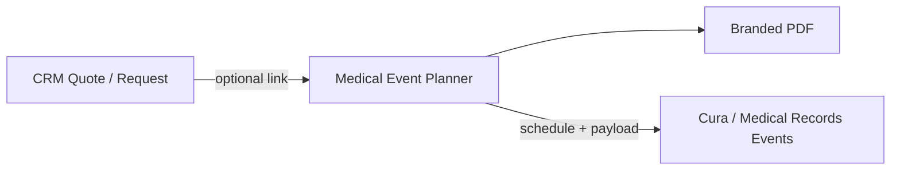

# PRD & QA Plan: CRM Module, Quote Engine, and Medical Event Planner

**Status:** Planning (QA overseer draft)  
**Repo:** Sparrow ERP  
**Related:** `fleet_management`, `hr_module`, `time_billing_module`, `event_manager_module`, `medical_records_module` (Cura), core manifest / site settings  
**Implementer handoff:** See **§14** for repo pointers, first tasks, and how a **new Cursor agent** should use this document.

---

## 1. Executive summary

Clients want:

1. A **feature-rich CRM** consistent with existing Sparrow modules (admin shell, permissions, install/upgrade pattern, mobile-friendly public surfaces where needed).
2. **Quotes:** maker, **rule-based calculator**, and **pipeline tracker**—all driven by **admin-configured rules in the UI** (no JSON editing for operators).
3. **Security:** **CSRF** on every state-changing browser form (and documented patterns for AJAX).
4. A **Medical Event Planner** inspired by products such as **[Salus3 Cloud](https://www.salus3.co.uk/)** (pre-hospital / event medical planning: service requests, plans, risk assessment, site context)—plus **Purple Guide–aligned** questioning (industry medical provision guidance; see [The Purple Guide — Medical](https://www.thepurpleguide.co.uk/medical)), **event details**, **location**, **nearest hospitals**, and **branded PDF** output (company name + logo from **core settings**).
5. **Integrated flow:** optional link from **quote / request** → planner → **PDF** → **publish into Cura / medical events** on scheduled dates for a coherent end-to-end journey.

This document is the **QA overseer plan**: scope, architecture, test strategy, phases, and acceptance criteria—not implementation.

---

## 2. Product references (non-binding)

| Reference | Relevance |
|-----------|-----------|
| **Salus3 Cloud** | UK-focused event medical / pre-hospital tooling; public materials describe **CRM-style service requests**, **event medical plans**, **risk assessment**, **map/site “Size Up” style** planning, rotas, documents, reporting. Use as **inspiration for workflow depth**, not a clone. |
| **The Purple Guide (Medical)** | Industry **guidance** on medical cover at events. Sparrow should implement **structured questionnaires** and **traceability** (“aligned with typical Purple Guide considerations”)—**not** reproduce copyrighted guide text without licence. Link out + configurable org-specific checklists where needed. |

---

## 3. Goals and non-goals

### 3.1 Goals

- **CRM:** accounts, contacts, opportunities/deals, activities, optional link to existing **HR / Fleet / Time billing** entities where product agrees.
- **Quotes:** versioned quotes, line items, **rules engine** (tiers, surcharges, caps, bundles) edited via **forms/tables**, live **calculator** preview, **status tracker** (draft → sent → accepted → lost, etc.).
- **Medical Event Planner:** wizard capturing **Purple Guide–style criteria** (crowd profile, event type, duration, environment, water/crowd movement, etc.—**field sets configurable by admin**), **event metadata**, **geocoded location**, **nearest hospitals** (third-party API or curated dataset—product decision), **risk assessment** narrative + scoring if required.
- **PDF:** single downloadable **Event Plan + Risk Assessment** with **branding** from core manifest (`company_name`, `logo_path`, etc.).
- **Integration:** optional **CRM quote/request** as planner input; planner output **creates or updates** a **Cura-facing “event”** (see §6) for **scheduled publication**.

### 3.2 Non-goals (v1)

- Replacing full **CAD / ePCR** (Cura) inside CRM.
- **Legal advice** encoded in software (risk assessment is **organisational documentation**; disclaimers in UI/PDF).
- **Offline-first** native apps (web-first; PWA later optional).

---

## 4. Architecture (high level)

### 4.1 New and existing components

| Piece | Suggestion |
|-------|------------|
| **`crm_module` (new)** | Blueprints: internal admin (`/plugin/crm_module/...`), optional customer portal later. `install.py` for tables + migrations (mirror `hr_module` / `fleet_management`). |
| **Quote rules** | Tables: `crm_quote_rule_set`, `crm_quote_rules` (typed columns + optional `conditions_json` **internal only**—built by UI, not shown as raw JSON to users). |
| **Medical planner** | Sub-area under CRM or `crm_medical_planner` namespace: `crm_event_plans`, `crm_event_plan_sections`, `crm_event_plan_pdfs` (artifact storage path or blob). |
| **`event_manager_module` (existing)** | Evaluate **reuse** for public “business events” vs **new** `medical_event` type—avoid duplicate calendars unless merged by category. |
| **`medical_records_module`** | **Integration layer:** API or internal service to create **publishable event** records Cura already understands (see §6). |

### 4.2 Rules engine (UI-first)

- **Admin:** “Rule sets” (e.g. “Default 2026”, “Festival tier”).
- **Rule types:** e.g. flat fee per hour, per medic role, crowd band multiplier, minimum charge, travel band, VAT toggle.
- **Editor:** grid + modal (conditions: dropdowns/numbers), **test harness** (“Sample crowd 5k, 8h → £X”).
- **Storage:** normalized rows; JSON only in DB as **serialized form** of what the UI built (optional); **export/import** for admins via **file upload** (validated), not hand-edited JSON in production UI.

### 4.3 PDF generation

- **Library:** e.g. WeasyPrint / ReportLab / HTML→PDF (align with existing stack if any).
- **Template:** Jinja2 HTML template + CSS; inject **logo** from persistent path (same sanitisation as other modules).
- **Versioning:** store `pdf_generated_at`, `pdf_hash` or file path for audit.

---

## 5. Medical Event Planner — functional outline

### 5.1 Wizard steps (configurable)

1. **Context** — Link optional **CRM quote / opportunity** (pull client, site contact, budget hints).
2. **Purple Guide–aligned checklist** — Admin-maintained **question groups** (yes/no, numeric, select). Help text links to org policy or external guidance.
3. **Event details** — Name, type, dates/times, expected attendance, demographics, alcohol, indoor/outdoor, water features, etc.
4. **Location** — Address/postcode, map pin, **what3words** optional, site boundary notes.
5. **Hospitals & access** — Auto-suggest **nearest A&E/UTC** (API key in core settings); manual override list.
6. **Resources & mitigations** — Planned medics, vehicles, comms, escalation paths (ties to Fleet/HR later optional).
7. **Risk assessment** — Residual risk summary, sign-off fields (name, role, datetime).
8. **Review & PDF** — Preview; **Generate PDF**; **Submit for publication** (§6).

### 5.2 Salus3-inspired differentiators (roadmap)

- **Map-centric “size up”** (phase 2+): embed map, annotations, saved snapshots in PDF appendix.
- **Post-event** closure report linked to same plan ID (phase 2+).

---

## 6. Integration: Quote → Planner → Cura events

### 6.1 Intended flow

### 6.2 Contract (to be agreed with Cura maintainers)

- **Identifier:** `crm_event_plan_id` (or UUID) carried into medical module.
- **Payload:** title, description, location summary, **start/end**, **visibility**, **public slug** if applicable, attachment refs (PDF URL or secure download token).
- **Publication:** respect existing **workflow** (draft → approved → published on `publish_at`).
- **Idempotency:** “Regenerate PDF” must not duplicate published events without version bump.

### 6.3 `event_manager_module`

- Decide: **extend** with `event_category = medical` and shared calendar UI, or **keep medical events in Cura only** and CRM only **hands off**. QA recommendation: **single source of truth** for **clinical/public medical listings** = Cura; **event_manager** for generic business marketing events unless merged explicitly.

---

## 7. CSRF (QA requirements)

Sparrow uses **SeaSurf** (`create_app.py`); patterns include `csrf_token()` in Jinja and `sparrow_csrf_head.html` for AJAX.

### 7.1 Checklist for CRM + Planner

| Surface | Requirement |
|---------|-------------|
| All HTML `<form method="post">` | Hidden `csrf_token()` field (same as HR/Fleet templates). |
| AJAX POST/PUT/DELETE from admin UI | `X-CSRFToken` header + token from meta or inline script global. |
| PDF “generate” if POST | CSRF protected; if GET, **avoid** side effects or use POST. |
| Public quote request form (if any) | CSRF + rate limit + honeypot optional. |

### 7.2 QA tests

- Attempt POST **without** token → **403/400** per app behaviour.
- Token rotation / double-submit: document expected behaviour.
- Regression: new blueprints registered in `create_app` **inherit** CSRF unless explicitly exempt (document exemptions in PR).

---

## 8. QA strategy (overseer)

### 8.1 Test phases

| Phase | Focus |
|-------|--------|
| **P0 Smoke** | Module install/upgrade, admin login, empty states, permissions deny unauthorised roles. |
| **P1 CRM** | CRUD accounts/contacts/opportunities; quote create/edit; rule set apply; calculator matches golden cases. |
| **P2 Planner** | Full wizard; PDF contains correct branding; hospital stub when API off. |
| **P3 Integration** | Quote→planner link; planner→Cura event; scheduled publish at boundary times (DST). |
| **P4 Non-functional** | Mobile wizard usability, large PDFs, concurrent edits, audit log entries. |

### 8.2 Golden cases (calculator)

- Document **10–20** fixed scenarios (input → expected total) in `tests/` or spreadsheet traceable to rule IDs.
- Regression on **rule reorder** and **inactive rule sets**.

### 8.3 Accessibility & UX

- Wizard: stepper, keyboard focus, error summary at top.
- No **required** JSON; all config through UI with validation messages.

---

## 9. Acceptance criteria (sample)

1. **AC-CRM-1:** Sales user can create account, contact, opportunity without touching JSON.
2. **AC-Q-1:** Admin defines a rule set in UI; quote total matches calculator for approved golden cases.
3. **AC-Q-2:** Quote status history visible (who/when).
4. **AC-MEP-1:** Planner completes with location + hospital section; PDF includes company name and logo from core settings.
5. **AC-MEP-2:** Purple Guide–aligned questions are **admin-editable** (wording), with audit of changes.
6. **AC-INT-1:** From an opportunity, user can “Create event plan” pre-filled; on submit, Cura shows scheduled event (given integration flag on).
7. **AC-SEC-1:** All mutating forms include valid CSRF; automated test or manual checklist signed off per release.

---

## 10. Phased delivery (recommended)

| Release | Deliverables |
|---------|----------------|
| **R1** | `crm_module` scaffold, accounts/contacts, CSRF baseline, permissions. |
| **R2** | Quotes + rule set UI + calculator + tracker. |
| **R3** | Medical Event Planner wizard + PDF (branding). |
| **R4** | Cura event handoff + scheduling; optional `event_manager` alignment. |
| **R5** | Map size-up, post-event report, advanced reporting. |

---

## 11. Risks & mitigations

| Risk | Mitigation |
|------|------------|
| Purple Guide **licensing** | Structure only; link to official guide; org-specific supplements. |
| **Hospital data** accuracy | Disclaimers; configurable fallback list; API SLA monitoring. |
| **PDF** performance | Async job queue if slow; progress UI. |
| **Duplicate events** in Cura | Idempotent API + `external_ref` column. |
| **Scope creep** | Strict phase gates; CRM core before planner. |

---

## 12. Open questions (for product / clients)

1. **Target roles:** CRM for sales only vs also **ops/medical planners**?
2. **Multi-tenant** branding: per-site logo already in core—enough for PDF?
3. **Cura schema:** exact table/service for “events to publish”?
4. **Salus3 parity:** which features are **must-have** vs **phase 2** (client sign-off)?
5. **Quotes and VAT** jurisdiction rules?

---

## 13. Next engineering steps (after plan approval)

1. Spike: PDF from core `logo_path` + one planner section (technical feasibility).
2. Spike: Cura event create from Flask (internal call vs HTTP).
3. ERD + `install.py` table list for `crm_module`.
4. CSRF template partial shared across CRM admin templates.

---

## 14. Implementer handoff (new Cursor agent / fresh engineer)

This section exists so someone opening a **new chat** can paste a single instruction—for example: *“Implement R1 from `docs/dev/PRD_QA_CRM_MEDICAL_EVENT_PLANNER.md`; follow §14.”*—and get consistent results.

### 14.1 How to use this document

1. Read **§1 (summary)**, **§3 (goals/non-goals)**, **§10 (phased delivery)**, and **§12 (open questions)** first.
2. Implement **one release (R1, R2, …) at a time**; do not start Cura integration (R4) until **§6.2 contract** is resolved or spiked.
3. Treat **§9 acceptance criteria** as the checklist for the phase you are in.
4. After any new blueprint or form, verify **§7 CSRF** before merging.

### 14.2 Repo map (where to look)

| Topic | Where |
|--------|--------|
| App factory, SeaSurf / CSRF | `app/create_app.py` (search `csrf`, `SeaSurf`) |
| CSRF in templates / AJAX | `app/templates/partials/sparrow_csrf_head.html`, grep `csrf_token` under `app/plugins/` |
| Plugin registration pattern | `app/plugins/*/routes.py`, `app/plugins/*/install.py`, `manifest.json` per plugin |
| Reference modules to mirror | `app/plugins/hr_module/`, `app/plugins/fleet_management/` (admin base templates, install, permissions) |
| Public / business events | `app/plugins/event_manager_module/` |
| Medical / Cura touchpoints | `app/plugins/medical_records_module/` (grep `event`, `cura`, routes) |
| Core site name / logo | Core manifest / settings (grep `logo_path`, `company_name` in `app/` as used by other modules) |

### 14.3 Conventions to match

- **Blueprint URL prefix:** follow existing plugins (e.g. `/plugin/<module>/...`).
- **Templates:** extend the same admin base pattern as Fleet/HR; keep spacing and nav consistent.
- **Database:** `install.py` with idempotent `CREATE TABLE IF NOT EXISTS` / migrations consistent with other plugins.
- **Permissions:** gate routes the same way sibling modules do (reuse existing decorators/helpers if present).
- **No operator JSON:** configuration is forms/tables only; any JSON in the DB is **machine-internal**, built by the UI.

### 14.4 Suggested first implementation slice (R1 only)

1. Add `app/plugins/crm_module/` with `manifest.json`, `routes.py`, `install.py`, minimal `templates/` (list + empty state).
2. Register blueprint in the same manner as other plugins (find where `hr_module` or `fleet_management` is wired).
3. Tables: e.g. `crm_accounts`, `crm_contacts` (minimal columns)—enough for CRUD smoke tests.
4. Every POST form includes `csrf_token()`; any `fetch` POST copies the project’s CSRF header pattern.
5. Manual or automated check: unauthenticated / wrong role cannot access CRM admin URLs.

### 14.5 What to document in the PR / commit message

- Phase (**R1–R5**) and which **AC-*** items are addressed.
- Any **CSRF exemption** (route name + justification)—should be rare.
- If integration was **not** done: state “Cura handoff deferred; see §6.2.”

### 14.6 Limits for agents

- **Do not** paste copyrighted Purple Guide text into the product; use **structure + links** (§2, §11).
- **Do not** assume Salus3 feature parity without client sign-off (§12).
- Prefer **small PRs** per phase over one giant CRM dump.

---

*Document owner: QA / Engineering. Update when Cura integration contract is finalised.*
