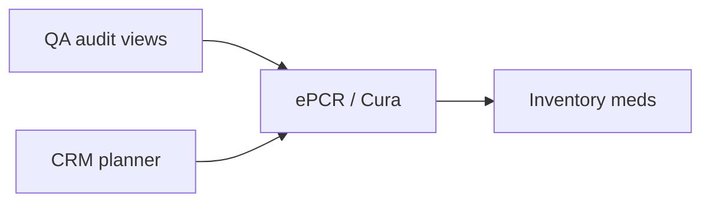

# QA overseer: client audit feedback — routing & PRD allocation

**Source:** Client audit / product feedback (consolidated).  
**Purpose:** Decompose into **owned work packages**, traceable IDs, and acceptance themes for Cura, Medical Records, CRM, HR, Inventory, Time billing / Rota, and cross-cutting QA governance.

**Cursor agents:** Use **`docs/dev/AGENT_PRD_INDEX.md`** + **`docs/dev/CURSOR_AGENT_ENTRY_PROMPT.md`** to discover `read_order` PRDs before coding (see §8).

---

## 1. Executive summary

| Theme | Primary owner | Risk / note |
|--------|----------------|-------------|
| **QA audit suite** (complaint triggers, scoring, GDPR-safe view, feedback loop) | **Medical Records** + **Sparrow governance** | DPIA: aggregate/score vs raw record access |
| **ePCR trauma / ATMIST / drugs–inventory** | **Cura** (+ **Inventory** API for drugs) | Clinical sign-off on MOI templates |
| **Rota / shifts** (address-per-shift, pay type, role eligibility) | **Time billing** (or dedicated rota module) | Workforce rules vary by contract |
| **CRM hospital search bug** | **CRM** / **Medical Records** handoff | **P0** data quality |
| **CRM ↔ Cura event link UX** | **CRM** + **Cura** + copy | Discovery, not only capability |
| **HR appraisals** | **HR module** | Standard employment practice |
| **Inventory kit bags & meds register** | **Inventory** (+ **Medical Records** for EPCR crosswalk) | Regulated medicines governance |

---

## 2. Master routing matrix

| ID | Summary | Owner | Type | Priority |
|----|---------|-------|------|----------|
| **QA-CC-001** | Company-configured **chief complaints** that **trigger** a QA audit workflow | Medical Records / Compliance | Feature | P1 |
| **QA-RND-001** | **Randomised EPCR** selection for QA (sample % / pool rules) alongside complaint triggers | Medical Records / Compliance | Feature | P1 |
| **QA-SCORE-001** | QA audit: per-section outcome **Compliant / Partial / Non-compliant / N/A** with **auto-scoring** of PT-relevant details and **rolled-up compliance %** | Medical Records / Compliance | Feature | P1 |
| **QA-GDPR-001** | Auditor workflow that **does not require routine full EPCR identity exposure** — governance view (scores, flags, de-identified where policy allows) aligned with **UK GDPR / DPA 2018** and **CQC** assurance expectations | Medical Records + Legal/Gov | Feature + policy | P0 |
| **QA-FB-001** | **Free text**: improvements needed + other feedback; **publish/share** summary back to **staff** as QA feedback (role-gated) | Medical Records / Compliance | Feature | P1 |
| **CURA-TRM-001** | **Trauma** section: MOI capture with **diagrams**; penetrating injuries incl. **STAB5** + aids per clinical lead | Cura | Feature | P2 |
| **CURA-RTC-001** | **RTC** tab: **Car / Van / Lorry** diagrams, mark/describe damage, **speed**, **photo upload**, other RTC treatment factors | Cura | Feature | P2 |
| **CURA-FALL-001** | **Fall from height**: height, **site type**, **landing surface** material, narrative | Cura | Feature | P2 |
| **CURA-ATMIST-001** | **ATMIST** page: **auto-populated** from ePCR where possible, **fully editable**, supports NHS/industry handover | Cura | Feature | P1 |
| **CURA-DRUG-INV-001** | **Drugs** documentation **ties to inventory drugs register** (draw/stock movement + EPCR ref) | Cura + Inventory | Integration | P1 |
| **ROTA-ADDR-001** | **Shift creation**: allow **full address per shift** (not only pre-created sites) + **staff job role** | Time billing / Rota | Feature | P1 |
| **ROTA-PAY-001** | Pay model: **hourly or day rate** (not only “labour cost” framing) | Time billing / Rota | Feature | P1 |
| **ROTA-ROLE-001** | **Shift eligibility**: e.g. **ECA cannot apply/take Para shift**; **Para may take ECA** shift (configurable role ladder) | Time billing / Rota | Feature | P1 |
| **CRM-HOSP-001** | **Nearest hospitals by postcode** incorrect (e.g. **DT7 Dorchester area → London**) — fix geocoding, search radius, and result ranking | CRM (Sparrow) | **Bug (P0)** | P0 |
| **CRM-CURA-LINK-001** | **CRM ↔ Cura** event linkage **obvious** in UI (labels, wizard step, “Open in Cura”, status) | CRM + Cura | UX | P1 |
| **HR-APPR-001** | **Staff appraisal** system (cycles, goals, signatures, history) | HR module | Feature | P2 |
| **INV-KIT-002** | **Kit bag types** (response, burns, O₂, Entonox, etc.): consumables + **expiry** + **searchable LOT**, **sign-out** to vehicle/staff, **asset numbers** | Inventory | Feature | P1 |
| **INV-MEDS-001** | **Full meds register**: compose **drug bags**, stock in/out, **crosswalk to EPCR** usage for **restock per bag** (who / what / which EPCR), **permanent** audit-friendly records | Inventory + Medical Records | Feature | P0 |
| **INV-MEDS-002** | **Witness rules** configurable: **restock to HQ**, **restock to bag**, **disposal** | Inventory | Feature | P1 |
| **INV-MEDS-003** | UX: “what’s present / missing / to add” **restock clarity** on bag return | Inventory | UX | P1 |

---

## 3. PRD bundles by agent

### 3.1 QA / governance / Medical Records (aggregate audit)

**Epic QA-1 — Triggers & sampling (QA-CC-001, QA-RND-001)**  
Acceptance: Admin defines complaint codes / form slugs that enqueue QA; random sample uses auditable seed/rules (e.g. % per month, exclusions).

**Epic QA-2 — Scoring model (QA-SCORE-001)**  
Acceptance: Each rubric section maps to four outcomes; system computes **% compliant** (define weighting for N/A); version rubrics with effective dates.

**Epic QA-3 — Privacy-by-design (QA-GDPR-001)**  
Acceptance: DPIA-reviewed modes — e.g. auditor sees **checklist + scores** first; **re-identification** only with break-glass permission; all views **logged**; aligns with `PRD_COMPLIANCE_AUDIT_SUITE_CQC.md` themes.

**Epic QA-4 — Feedback loop (QA-FB-001)**  
Acceptance: Structured + free text stored; **staff notification** (in-app/email) with configurable redaction; link back to audit ID without leaking unrelated cases.

---

### 3.2 Cura / ePCR agent

**Epic CURA-T — Trauma & RTC & fall (CURA-TRM-001, CURA-RTC-001, CURA-FALL-001)**  
Acceptance: Diagrams + photos stored with case; export/handover includes MOI summary; STAB5 content **approved by clinical lead**.

**Epic CURA-A — ATMIST (CURA-ATMIST-001)**  
Acceptance: Field mapping from primary survey / dispatch / demographics documented; manual override always available; PDF/handover block.

**Epic CURA-D — Drugs & inventory (CURA-DRUG-INV-001)**  
Acceptance: Drug event on ePCR creates or reserves **inventory line** with lot/bag ref where configured; conflicts (stock negative) surface clearly.

---

### 3.3 Time billing / Rota agent

**Epic ROTA-1 — Shift model (ROTA-ADDR-001, ROTA-PAY-001)**  
Acceptance: Shift record stores geocoded address or validated postcode; pay type hourly/day with rate fields; reports unchanged or migrated.

**Epic ROTA-2 — Role rules (ROTA-ROLE-001)**  
Acceptance: Configurable matrix (role A may take role B shifts); application UI hides ineligible shifts; audit log of exceptions if overrides exist.

---

### 3.4 CRM agent (Sparrow `crm_module`)

**Epic CRM-1 — Hospital geocoder (CRM-HOSP-001)**  
Acceptance: Postcode **DT7** resolves to correct national grid / lat-lng; hospitals ranked by **distance** from that point, not default London; unit tests with known postcodes; fallback message if API offline.

**Epic CRM-2 — Cura link UX (CRM-CURA-LINK-001)**  
Acceptance: Event medical plan screen shows **linked Cura event** state + deep link; empty state explains how to publish; cross-link in Cura back to CRM plan ID.

---

### 3.5 HR agent

**Epic HR-APPR — Appraisals (HR-APPR-001)**  
Acceptance: Manager/employee cycle, document storage, optional PDF, permissions by org.

---

### 3.6 Inventory agent

**Epic INV-KIT — Bags (INV-KIT-002)**  
Acceptance: Bag templates, line items, LOT search, checkout to asset (vehicle/person), recall query by LOT.

**Epic INV-MEDS — Register & EPCR (INV-MEDS-001–003)**  
Acceptance: Drug bag BOM; consumption rows tied to **EPCR id**; restock checklist; witness prompts per action type; retention matches clinical record policy.

---

## 4. Cross-dependencies



- **CRM-HOSP-001** blocks trust in **event medical plans**; fix before marketing planner to NHS partners.  
- **INV-MEDS-001** and **CURA-DRUG-INV-001** should be **one integration contract** (event schema, idempotency).  
- **QA-GDPR-001** must be signed off with **DPO** before auditors use production data.

---

## 5. Sequencing (QA view)

| Wave | Items |
|------|--------|
| **W0 Hotfix** | CRM-HOSP-001 |
| **W1** | QA-GDPR-001 (policy + MVP aggregate view), INV-MEDS-001 spike, CURA-ATMIST-001 |
| **W2** | QA-SCORE-001, QA-CC-001, QA-RND-001, ROTA-ROLE-001, CURA-DRUG-INV-001 |
| **W3** | QA-FB-001, ROTA-ADDR-001, ROTA-PAY-001, INV-KIT-002, CRM-CURA-LINK-001 |
| **W4** | CURA-TRM-001, CURA-RTC-001, CURA-FALL-001, HR-APPR-001 |

---

## 6. Questions back to client / clinical

1. **QA scoring:** Weight of **Partial** vs **Non-compliant**? Double-weight critical sections?  
2. **Randomisation:** Stratify by site, clinician, or complaint rate?  
3. **STAB5 / MOI:** Single national protocol or org-specific?  
4. **Role ladder:** Formal list (ECA, Tech, Para, Dr) and which can cover which shifts?  
5. **Meds witness:** Two-person for all CDs or per drug category?

---

## 7. Suggested child PRD filenames

| File | Owner |
|------|--------|
| `docs/dev/PRD_QA_AUDIT_EPCR_GOVERNANCE.md` | Medical Records / compliance |
| `docs/dev/PRD_CURA_TRAUMA_ATMIST_2026-04.md` | Cura |
| `docs/dev/PRD_ROTA_SHIFT_RULES_2026-04.md` | Time billing (feature PRD — TBD) |
| `docs/dev/PRD_CURSOR_AGENT_TIMESHEET_SCHEDULING.md` | Time billing — **Cursor agent charter** (`sparrow_timesheet_scheduling`; read via `AGENT_PRD_INDEX`) |
| `docs/dev/PRD_CRM_HOSPITAL_GEO_FIX.md` | CRM |
| `docs/dev/PRD_INVENTORY_KIT_MEDS_REGISTER.md` | Inventory |
| `docs/dev/PRD_HR_APPRAISALS.md` | HR |

This document is the **index**; child PRDs can lift IDs verbatim.

---

## 8. Handing off to specialised Cursor agents (PRD discovery flow)

**Design:** The agent does **not** rely on a long pasted spec. It uses a **fixed entry prompt**, opens **`docs/dev/AGENT_PRD_INDEX.md`**, finds its **`agent_id`**, then reads every file in **`read_order`**.

### 8.1 Files to use

| File | Role |
|------|------|
| **`docs/dev/CURSOR_AGENT_ENTRY_PROMPT.md`** | Copy-paste **entry prompt** for any agent |
| **`docs/dev/AGENT_PRD_INDEX.md`** | **Router:** `agent_id` → ordered list of PRDs + routing docs |
| **`docs/dev/QA_CLIENT_AUDIT_ROUTING_2026-04.md`** | This doc: April audit **IDs**, matrix, epics (PRD until child files exist) |

### 8.2 Human workflow

1. Open **`CURSOR_AGENT_ENTRY_PROMPT.md`**, copy the block.
2. Set **`agent_id`** (e.g. `sparrow_crm`, `cura_clinical` — see index table).
3. Set **`Task:`** (optionally add **scope IDs** or **phase**, e.g. “CRM-HOSP-001 only, W0 hotfix”).
4. Paste into Cursor in the **correct workspace**; add `@docs/dev/AGENT_PRD_INDEX.md`.

The agent **must** read **`read_order`** from the index (which includes this routing doc when relevant), then implement.

### 8.3 Example tasks (short — full detail lives in PRDs after discovery)

```text
agent_id: sparrow_crm
Task: Fix CRM-HOSP-001 (P0) then CRM-CURA-LINK-001. Phase: hospital bug first, one PR.
```

```text
agent_id: cura_clinical
Task: CURA-ATMIST-001 only for this PR; CURA-DRUG-INV-001 stub contract if inventory API missing.
```

```text
agent_id: sparrow_inventory
Task: Spike INV-MEDS-001 data model + EPCR crosswalk; no UI yet.
```

```text
agent_id: sparrow_timesheet_scheduling
Task: Client audit §3.3 — implement ROTA-ROLE-001 first (one PR), then ROTA-ADDR-001 and ROTA-PAY-001 as separate PRs.
```

### 8.4 When you add a new child PRD

1. Add the file under `docs/dev/`.
2. Update **`AGENT_PRD_INDEX.md`**: insert the path into the right row’s **`read_order`** (after `routing_doc`).
3. Update **§ Child PRDs status** in the index when a “TBD” file exists.

### 8.5 Cursor usage tips

| Tip | Why |
|-----|-----|
| **`@AGENT_PRD_INDEX.md`** in the first message | Forces discovery step |
| **One chat per repo** | Cura vs Sparrow contexts stay clean |
| **IDs in Task** | Narrows work after PRDs are read |
| **Orchestrator chat** | `agent_id` omitted; task = “contract only for CURA-DRUG ↔ INV-MEDS” + `@AGENT_PRD_INDEX` rows for both |

---

*QA routing — update as items ship or scope changes.*
